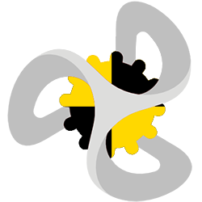
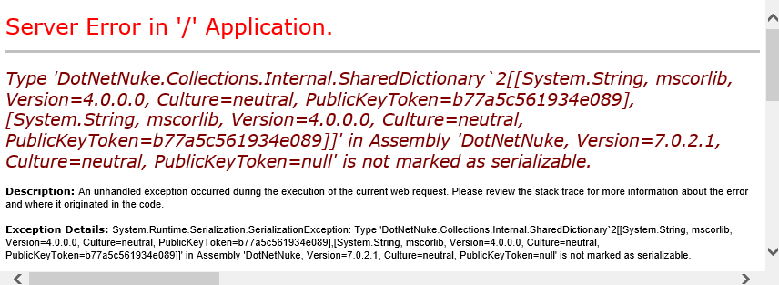
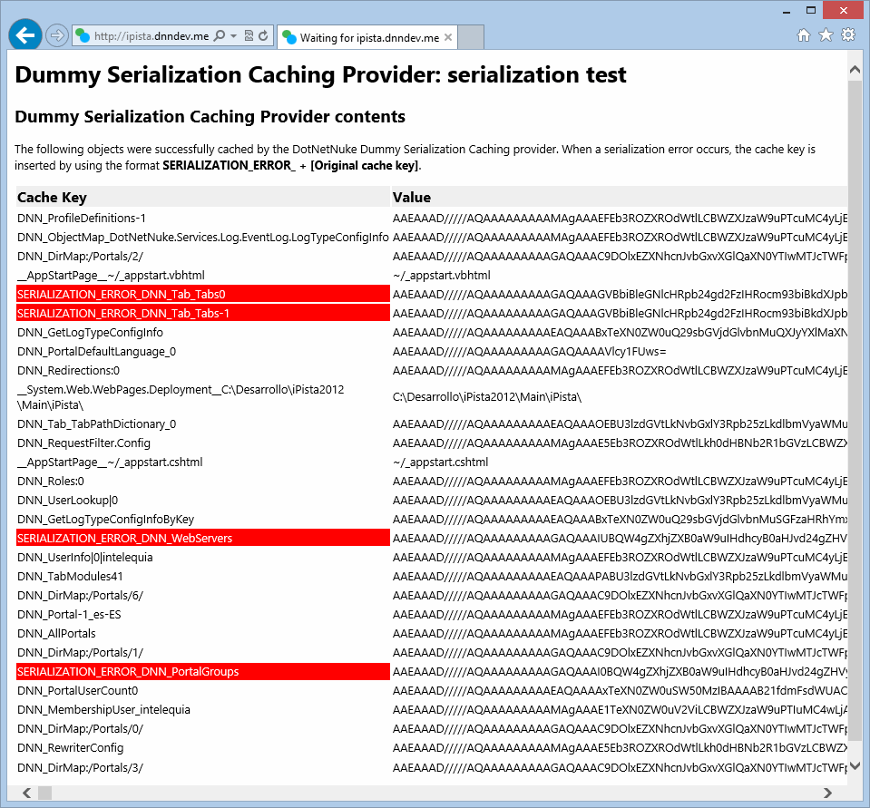

# DNN Dummy Caching Provider
>
This caching provider allows you to verify that your module code suits the “out-of-process” caching requirements of cache systems like Redis Caching

**Do you want to create modules that are Microsoft Azure compatible? Are you going to use other out-of-process caching providers like Redis or memcached? Do you want your modules to meet DotNetNuke webfarm requirements?**

This caching provider **allows you to verify in your development environment** that the running code suits the “out-of-process” caching requirements, what means that **all the cached objects must be serializable**. While working on development, creating unit tests, etc. using this caching provider is highly recommended in order to create code that is compatible with out of process caches.

>Remember that another good source for verifying Microsoft Azure compatibility is to use the [DotNetNuke Extension Verification Service](http://evs.dotnetnuke.com/), that runs SQL Azure compatibility checks including real operations on an SQL Azure database.

## Release Notes
* Changes the default caching provider on the web.config to “DummySerializationCachingProvider”
* All the cached objects are serialized (using XmlBinary) before being cached. On the GetItem method the object is deserialized
* On uninstall, sets the default caching provider on the web.config to “FileBasedCachingProvider”
* Possible attributes on the provider configuration in the web.config file:
	* _“useCompression”_ (true/false): uses compression after/before applying the serialization. Default “false”;
	* _“silentMode”_ (true/false): doesn’t throw serialization exceptions. Default “false”. If “true”, when a serialization error occurs, the object is cached with the key “SERIALIZATION_ERROR_” + key, to have a way to quickly track serialization errors on development (see next feature) and the exception is logged in the .log.resources file; if “false” the exception will be thrown without handling;
* **If the “Source” package is installed**, there is a page under “/Providers/CachingProviders/DummySerializationCachingProvider/TestCache.aspx” that shows the cache contents and the serialization errors. 

## Important

If you are running a DNN version earlier than 7.0.4, you will see some serialization issues on the DNN Core. All were fixed in 7.0.4 release.

If just after installing you see a serialization issue like the shown below, is not an issue with the caching provider, is just that an incompatibility was found. If you don't want the exceptions being thrown immediately, change the "silentMode" property in the web.config (check the release notes).

## Screenshots

